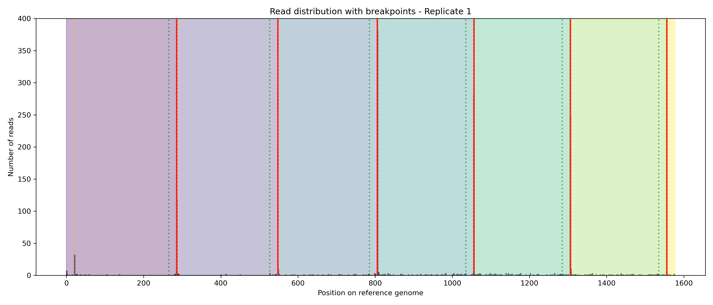
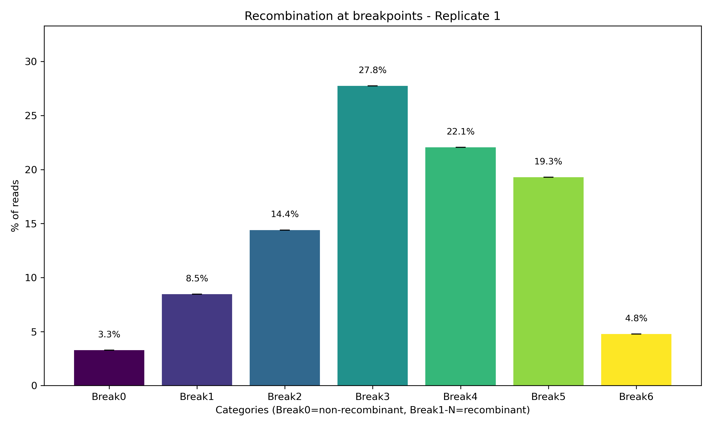
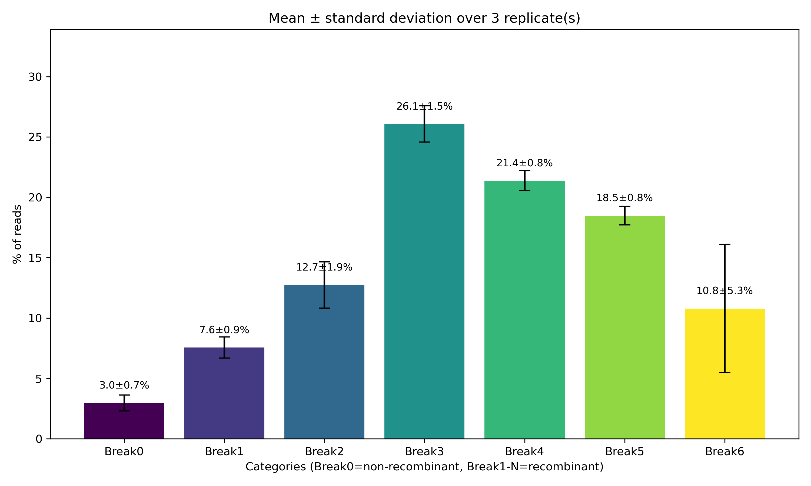

# Recombination Analysis Tool

## Description

`analyse_replicats.py` is a Python script for analyzing recombination events in sequencing data by detecting breakpoints based on attB sites and calculating the percentage of recombinant vs non-recombinant reads.

The tool:
- Maps reads to a reference genome using minimap2
- Automatically detects attB sequences in the reference
- Identifies breakpoints at position attB+21 (cut site between "gg")
- Calculates the percentage of reads in each interval (non-recombinant vs recombinant categories)
- Supports multiple replicates with statistical analysis (mean ± standard deviation)
- Generates comprehensive visualizations and summary statistics
- Uses a default attB sequence file unless the user provides a custom one

## Features

- Automatic breakpoint detection based on attB sequence 
- Default attB sequence file (attB_default.txt) automatically used
- Optional custom attB file via --attb myfile.txt 
- Multi-replicate support with standard deviation calculation  
- Visualization: histograms with colored intervals and barplots  
- Statistical summary exported to text files  
- Flexible directory structure

## Requirements

### Dependencies


# Core tools
minimap2
samtools

# Python packages
python >= 3.7
pysam
numpy
matplotlib
biopython
scipy


### Installation

```bash
# Install via conda (recommended)
conda create -n recomb_analysis python=3.9
conda activate recomb_analysis
conda install -c bioconda minimap2 samtools pysam biopython
conda install -c conda-forge numpy matplotlib scipy

# Or via pip
pip install pysam numpy matplotlib biopython scipy
```

## Usage
### Basic command

Usage :

```bash
python3 analyse_replicats.py \
    --ref REF \
    --read READ \
    [--rep REP] \
    [--datadir DATADIR] \
    [--resdir RESDIR] \
    [--attb ATTB]
```

options: 
```bash
-h, --help         Show this help message and exit
--ref REF          Reference prefix (without .fa)
                   Example: ref2.12 → ref2.12.fa
--read READ        Reads prefix (without .fastq)
                   Example: data2.12 → data2.12-1.fastq, data2.12-2.fastq ...
                   Replicates must follow the format: prefix-1.fastq, prefix-2.fastq, etc.
--rep REP          Number of replicates (default = 1)
--datadir DATADIR  Directory containing reference and read files
--resdir RESDIR    Output directory for results
--attb ATTB        Optional file containing a custom attB sequence
                   If omitted, the default attB file is automatically used
```

attB sequence handling :
- If --attb is provided, the script loads the attB sequence from the given file.
- If not, it automatically loads the default file:

```bash
RecombCompet/data/attB_default.txt
```
- The sequence must be written as a single line of nucleotides (a/t/g/c) in lower case.
- The breakpoint is assumed to be located at position +21 of the attB motif.

---

## Input Files Structure

### Directory organization

```
RecombCompet/
── data/
│   ── ref2.12.fa          # Reference genome
│   ── data2.12-1.fastq    # Replicate 1
│   ── data2.12-2.fastq    # Replicate 2
│   ── data2.12-3.fastq    # Replicate 3
│   ── attB_default.txt    # attB sequence
└── res/                     # Results will be created here
```

### File naming convention

**Reference genome**: `<prefix>.fa`
- Example: `ref2.12.fa`

**Reads (replicates)**: `<prefix>-<N>.fastq`
- Example: `data2.12-1.fastq`, `data2.12-2.fastq`, `data2.12-3.fastq`
- N = replicate number (1, 2, 3, ...)

---

## Examples

### Single replicate analysis

```bash
python analyse_replicats.py \
    --ref ref2.12 \
    --read data2.12 \
    --rep 1
```

### Multiple replicates (3 replicates)

```bash
python analyse_replicats.py \
    --ref ref2.12 \
    --read data2.12 \
    --rep 3
```

### Custom directories

```bash
python analyse_replicats.py \
    --ref my_reference \
    --read my_reads \
    --rep 2 \
    --datadir /home/user/my_data \
    --resdir /home/user/my_results
```


### Using a custom attB file
```bash
python analyse_replicats.py \
    --ref my_reference \
    --read my_reads \
    --attb /home/user/my_data/my_attB_sequence.txt
```

---

## Output Files

All results are saved in `resdir/res_<reference_prefix>/`

### Per-replicate files

For each replicate N:

| File | Description |
|------|-------------|
| `alignment_N.sam` | SAM alignment file |
| `alignment_N.bam` | BAM alignment file |
| `align_sorted_N.bam` | Sorted and indexed BAM |
| `align_sorted_N.bam.bai` | BAM index |
| `reads_breakpoints_N.txt` | Detailed statistics per interval |
| `hist_breakpoints_N.png` | Histogram with colored intervals |
| `barplot_breakpoints_N.png` | Barplot of recombination percentages |

### Summary files (all replicates)

| File | Description |
|------|-------------|
| `barplot_breakpoints_mean_<ref>.png` | Mean percentages with error bars (SD) |
| `summary_statistics_<ref>.txt` | Statistical summary table |

---

## Output Interpretation

### Categories

- **Break0**: Non-recombinant reads (before first breakpoint)
- **Break1 to BreakN**: Recombinant reads (between successive breakpoints)
- **BreakN+1**: Reads after last breakpoint

### Example output (`reads_breakpoints_1.txt`)

```
# Breakpoint analysis: intervals based on attB+21 positions
# attB positions: [1000, 5000, 9000]
# Breakpoint positions (attB+21): [1021, 5021, 9021]
Category    Interval        Reads   Percentage
Break0      <1021          8500    85.00
Break1      1021-5021      800     8.00
Break2      5021-9021      500     5.00
Break3      >9021          200     2.00
```

### Visualizations

Each replicate produces an image:

**Histogram** (`hist_breakpoints_N.png`):
- Grey bars: read distribution along reference
- Colored zones: intervals between breakpoints
- Green dotted lines: attB start positions
- Red solid lines: actual breakpoints (attB+21)
- Orange dashed lines: automatically detected peaks

**Histogram example (`hist_breakpoints_1.png`):**



**Barplot** (`barplot_breakpoints_N.png`):
- X-axis: recombination categories
- Y-axis: percentage of reads
- Error bars: standard deviation (if multiple replicates)

**Barplot example (`barplot_breakpoints_1.png`):**


**Barplot with SD example (`barplot_breakpoints_mean_ref2.11.png`):**



---

## Methodology

### Breakpoint Detection

1. **attB sequence loading**:
The attB motif is not hard-coded. It is read from a file:
- If the user provides --attb custom_file.txt, the script loads that sequence.
- Otherwise, it automatically uses the default file:
```
RecombCompet/data/attB_default.txt
```
The file must contain the attB motif on a single line (a/t/g/c only).

2. **attB sequence identification**:
   ```
   attB = "gcccggatgatcctgacgacggagaccgccgtcgtcgacaagccggccga"
   ```
   The script searches for this 51 bp sequence (default attB sequence) in the reference genome.

3. **Breakpoint calculation**:
   ```
   Breakpoint position = attB_start + 21
   ```
   Position 21 corresponds to the cut site between "gg" nucleotides.

4. **Interval classification**:
   - Reads starting before the first breakpoint → non-recombinant
   - Reads starting between breakpoints → recombinant (different categories)

### Read Mapping

Uses **minimap2** with default parameters for accurate alignment:
```bash
minimap2 -a reference.fa reads.fastq > alignment.sam
```

### Statistics

For multiple replicates:
- **Mean**: average percentage across replicates
- **Standard deviation**: calculated with ddof=1 (Bessel's correction)


## Troubleshooting

### Common errors

**Error: "File not found"**
- Check that file names follow the correct convention
- Verify that `--datadir` points to the correct directory
- Ensure `.fa` and `.fastq` extensions are NOT included in `--ref` and `--read`

**Error: "No attB sequence found"**
- If attB is custom : Verify that '--attb' points to the correct file
- Verify that the attB sequence exists in your reference genome
- Check that the reference is in FASTA format (.fa)

**Low alignment rate**
- Verify read quality
- Check that reads match the reference genome

### Performance

**Memory usage**: ~2-4 GB for typical datasets  
**Time**: ~2-10 minutes per replicate (depends on data size)

For large datasets:
- Consider downsampling reads
- Use more threads if minimap2 supports it (modify script if needed)

---

## License

This script is provided as-is for research purposes under the GPL3.0 licence.

---

## Contact

For questions or issues, please contact: 
- capucine.mayoud@umontpellier.fr
- anna-sophie.fiston-lavier@umontpellier.fr

---

## Version History

**v1.0** (2025)
- Initial release
- Automatic attB detection
- Multi-replicate support
- Statistical analysis and visualization
